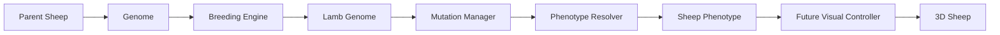

# Genetics and visual data flow



The mutation manager is invoked by the breeding engine after inheritance and validation; the diagram emphasizes that it remains an independent pipeline stage.

## Future scene

```text
SheepCharacter
├── Skeleton3D
├── BodyMesh
├── WoolMesh
├── HeadMesh
├── EarRoot (Upright / Side / Floppy variants)
├── HornRoot (Tiny / Curled / Spiral variants)
├── Eyes
└── PatternLayer
```

| Phenotype input | Intended visual control |
|---|---|
| Point color / dilution | Material parameters |
| Wool color | Wool material |
| Wool tone | Shader parameter |
| Graying | Age-driven shader parameter |
| Texture / volume / length | Blend shape, mesh variant, morph/scale |
| Point/wool patterns and amount | Texture masks and mask variation |
| Body size / build | Root scale and width morph |
| Leg length | Bone scale |
| Face shape | Blend shape |
| Ear shape / size | Mesh variant and scale |
| Horn presence / shape | Visibility and mesh variant |
| Lavender / rose | Material modifiers |
| Star mark | Face overlay mask |
